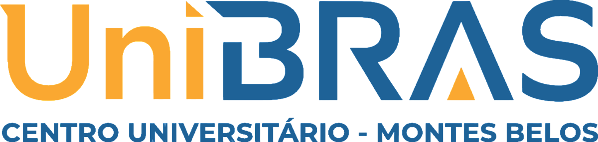

# UNIBRAS - Modelo de Documento para Projetos, Pesquisas e Disciplinas Específicas

<p align="center">
  <a href="https://sejaunibras.com.br"></a>
</p>

---

## 📌 Título do Projeto

> Vision Game — Controlador de jogo por visão computacional com gestos da mão.


---

## 👥 Equipe de Autores e Participantes

### 👥 Alunos

* [Rodrigo Rezende](https://www.linkedin.com/in/.../)
* [Kaiky Ferreira](https://www.linkedin.com/in/.../)
* [Nicole Carol](https://www.linkedin.com/in/.../)

### 👔 Docentes e Orientação

* **Orientador(a):** [FRANCISMAR ALVES MARTINS JUNIOR](https://www.linkedin.com/in/francismar-alves-martins-junior-8a320b90/)
* **Coordenador(a):** [Guilherme Nogeuira](#)

---

## 🔬 1️⃣ Modelo para Pesquisa e Relatórios Científicos

### 📝 Resumo

> Este projeto tem como objetivo desenvolver um controlador de jogo baseado em visão computacional, utilizando a webcam para detectar gestos da mão e convertê-los em comandos de teclado. A solução foi concebida como uma alternativa acessível ao controle físico ou ao teclado tradicional, permitindo que o usuário execute ações em um jogo ou emulador por meio de movimentos simples da mão. A implementação combina OpenCV e MediaPipe para capturar quadros, localizar landmarks da mão e classificar gestos em tempo real. O sistema também usa o módulo `pynput` para simular as teclas do teclado e possibilitar a interação com o jogo em foco. O trabalho busca validar a viabilidade do uso de gestos como entrada em um cenário de jogo local, discutindo desafios de detecção, confiabilidade e ergonomia do gesto.

### 🎯 Palavras‑chave

Visão computacional, OpenCV, MediaPipe, Gestos da mão, Controle de jogos, Python, Webcam, Interação humano-computador.

### 🕹️ Introdução

* O projeto nasce da ideia de controlar jogos sem o uso de teclado ou controle físico, usando gestos reais da mão detectados por câmera.
* O problema central é transformar uma interação visual em comandos confiáveis para um jogo em execução no computador.
* O objetivo é criar um protótipo funcional que reconheça gestos básicos e os converta em ações do jogo, com boa resposta em tempo real e baixa complexidade de uso.

### ⚡️ Metodologia

* A metodologia do projeto consiste em capturar frames da webcam, localizar a mão com MediaPipe e extrair landmarks para análise dos gestos.
* O classificador utiliza características geométricas dos pontos da mão para diferenciar gestos distintos, como mão fechada e dedo indicador estendido.
* A linguagem principal é Python, com bibliotecas OpenCV, MediaPipe e `pynput`.
* A validação foi realizada por meio de imagens do dataset interno do projeto, com treinos e teste do modelo KNN, além da execução da webcam em tempo real para verificar a resposta do gesto.

### 📊 Resultados e Discussões

* O projeto demonstrou que é viável detectar gestos da mão a partir de landmarks extraídos em tempo real.
* A detecção por landmarks permitiu distinguir uma mão fechada de um gesto com o dedo indicador estendido, que pode representar ações diferentes no jogo.
* A integração com `pynput` permitiu que os gestos fossem convertidos em eventos de teclado e enviados ao jogo em foco.
* O modelo também mostrou a importância de ajustar limiares de confiança e de manter a detecção estável para evitar disparos errados.

### 🏁 Conclusões e Trabalhos Futuros

* O protótipo alcançou a etapa inicial de reconhecimento de gestos e interação com teclado simulado, validando a proposta do projeto.
* A solução é adequada como MVP, com base para evoluções em mapeamento de gestos, calibração mais robusta e suporte a comandos mais elaborados.
* Como trabalhos futuros, pode-se expandir o conjunto de gestos, melhorar a precisão com mais imagens de treino, ajustar a detecção para diferentes iluminação e uso de mão, e integrar controles mais complexos ao jogo.

### 📚 Referências Bibliográficas

> - MediaPipe Hands Documentation. Google AI.
> - OpenCV Documentation. OpenCV.
> - Python `pynput` Library Documentation.
> - Requisitos do projeto e arquitetura definidos em `doc/requisitos.md` e `doc/tecnologias-arquitetura.md`.

### ⚡️ Anexos e Links

* Arquivos do projeto e dataset em `src/image/`.
* Notebook de treino e protótipo em `notebook.ipynb`.
* Documentos de requisitos e arquitetura em `doc/`.
* Emulador e jogo de referência em `super-mario-world-usa_202406/`.

---

## 💻 2️⃣ Modelo para Disciplinas Específicas (Ex.: Engenharia de Software, IA, Banco de Dados)

### 📄 Identificação

* Disciplina: Engenharia de Software / Visão Computacional
* Professor(a): [Nome do Professor(a)](#)

### 🎯 Tema e Contextualização

> O tema do projeto é a criação de um sistema de controle de jogos por gestos da mão usando visão computacional. A solução combina técnicas de processamento de imagem, detecção de landmarks e simulação de teclado para tornar a interação mais natural e acessível.

### 🗺️ Especificações do Projeto

* **Requisitos Funcionais e Não Funcionais**
* **Reconhecimento de gestos da mão em tempo real**
* **Mapeamento de gesto para comando e tecla**
* **Pré-visualização da câmera e indicação do estado do gesto**
* **Liberação de teclas quando o gesto deixa de ser reconhecido**
* **Uso local do processamento e armazenamento mínimo**

### ⚡️ Arquitetura e Stack Utilizado

* **Linguagem de Programação:** Python 3
* **Framework(s):** OpenCV, MediaPipe, `pynput`
* **Banco de Dados:** Não aplicável no MVP (uso de arquivos de configuração e modelo local)
* **Bibliotecas e Ferramentas de Suporte:** NumPy, `cv2`, `mediapipe`, `keyboard` via `pynput`, Jupyter Notebook

### 🛠️ Estrutura do Repositório

```python
vision_game/
├─ assets/
│  └─ recursos visuais e logo do projeto
├─ doc/
│  ├─ requisitos.md
│  └─ tecnologias-arquitetura.md
├─ document/
│  └─ documentação complementar
├─ src/
│  ├─ image/
│  │  ├─ move/
│  │  ├─ stop/
│  │  └─ gesture_model.npz
│  └─ readme.md
├─ notebook.ipynb
├─ requirements.txt
├─ README.md
├─ LICENSE
└─ super-mario-world-usa_202406/
```

### ⚡️ Instruções para Build e Execução

```bash
cd vision_game
python -m venv .venv
source .venv/bin/activate
pip install -r requirements.txt
jupyter notebook
```

Para executar o protótipo com webcam e controle de gesto, abra o notebook `notebook.ipynb` e execute as células em sequência. A última célula abre a câmera e ativa o controle por gesto.

### 📷 Evidências Visuais

> O projeto utiliza imagens de amostras da mão para treinamento do classificador e exibição da câmera em tempo real.

* Detecção da mão via landmarks do MediaPipe.
* Classificação de gestos via geometria das articulações.
* Simulação de tecla para interação com o jogo.

---

## ⚡️ Critérios de Avaliação (Ex. Disciplinas Específicas)

* Qualidade e clareza do código-fonte.
* Adequação às normas e padrões de projeto.
* Eficiência no reconhecimento de gestos.
* Usabilidade do protótipo e resposta em tempo real.
* Resultado final funcional com integração ao jogo ou emulador.

---

## 📅 Histórico de Versões

* **v0.1.0** - 10/10/2026 — Versão inicial do projeto com protótipo de detecção de gestos e controle por webcam.
* **v0.0.1** - 10/10/2026 — Estrutura inicial do repositório e documentação do conceito do projeto.

---

## 📋 Licença e Atribuições


[Modelo GIT UNIBRAS](https://github.com/yggdrasilGit/templatesUNIBRAS) por [UNIBRAS](https://sejaunibras.com.br) está licenciado sob [CC BY 4.0 International](http://creativecommons.org/licenses/by/4.0/?ref=chooser-v1).
